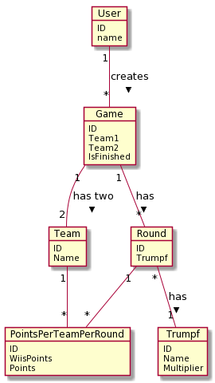

# Documentation

[toc]

## Description

This is a WebApp to record points for a "Schieber-Jass". The app has the following features: 

* Create/Delete a game
* Create/Delete Teams
* Insert rounds for a game 
  * for each team 
  * with the appropriate multiplier
  * show points on a "Jass"-table

## Architecture

The application consists of the following components:

The user has to be authenticated, each request to the server is protected with basic authentication. The Authentication is ensured by Traefik. Traefik is also configured to load balance all requests to access the static resource or the backend service. 

The API definition can be found [here](./swagger.yaml) and can be be viewed in the [online editor](https://editor.swagger.io) provided by swagger. The API provides access points for game, team and round use cases. The data fetching is done asynchronous and every request sends back a proper response, which is then handled on the client side, even if a  "wrong" request was sent.  For every request it's ensured that the requesting user only gets back data related to him. No calculations are done on the server, all calculations are done clientside.

## ERD

The database design is based on this ERD: 

This allows to store teams, games and the points made by each team per game. To goal was to make it as simple as possible but cover all use cases and possible extensions.

## Design Decisions

The application is a React Single Page Application calling a REST Service. We used this project to gain know-how in several technologies none of us had used before.  

The SPA is based on [react](https://reactjs.org/) and [TypeScript](https://www.typescriptlang.org/). It uses [create-react-app](https://github.com/facebook/create-react-app) this allowed us to directly start coding, as the create-react-app scripts care about the linting setup, the webpack setup, the testing setup and the production setup. We decided to use react as we already had some experience but wanted to dive deeper and share the knowledge among each other. The page makes use of many [MATERIAL-UI](https://material-ui.com/) components for proper styling.

[Webpack](https://webpack.js.org/) is used to bundle the typescript files and their dependencies into a single .js file, which then can be served as static resources.

The back-end is written in GO. The [https://github.com/swagger-api/swagger-codegen](https://github.com/swagger-api/swagger-codegen) was used to generate a lot of  boilerplate for the back-end, we then extended it and implemented the REST Service. We decided to use GO because we saw it in the lecture and were fascinated by the syntax and the possibilities. This was a new language for all of us, and in the beginning we had to overcome some struggles, but soon after we really started to like it and implemented our first services. 

The applications uses a [PostgreSQL](https://www.postgresql.org/) database. Starting the project, we originally had in mind to use mongo-db and query the engine with graphQL - turns out, learning a new coding language, a new database system AND a new querying language was too much and we caved. We had already worked with PostgreSQL before so this was nothing completely new, and a good opportunity to improve our knowledge as a preparation for the Data Engineering lecture. In the end this was a wise decisions because we could rely on existing knowhow (e.g. SQL) and focus on the other new technologies.

The system uses [Traefik](https://docs.traefik.io/) to route the application. Traefik was presented in our lecture and we were all very impressed by how easy it was to configure and wanted to try it out, that's why we decided to use Traefik. Our authentication is handled by Traefik, although its pretty primitive at the moment. There are only two users at the moment an no new users can be added 'on the fly' as the credential-information is stored in the docker configuration. This is something we'd address if we continue the project.

To combine all components and technologies we use [docker](https://www.docker.com/). Docker really helped us to get a common setup which works on all of or machines and it also makes it very easy to start the application. Also, none of us had much of experience with docker before (aside from "off the shelf" container use) so this again was a great opportunity to learn more about this great and fascinating technology. We created custom docker images for both the back-end servers (based on golang) and the front-end SPA server (based on nginx). These images are then integrated with the other, more standard images (postgres and traefik) which are configured in the [jasstable.yml](./docker/jasstable.yml) file.