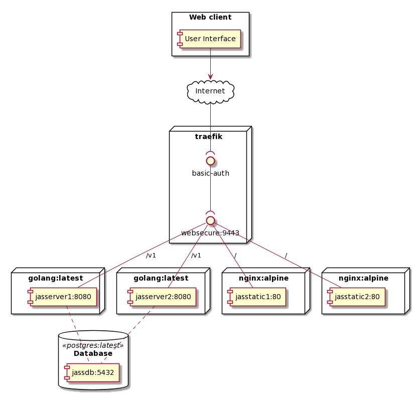

# Documentation

## Description

This is a WebApp to record points for a "Schieber-Jass". The app has the following features: 

* Create/Delete a game
* Insert rounds for a game 
  * for each team 
  * with the appropriate multiplicator

## Architecture

The application consists of the following components:

### Authentication

bibedi bidiebd bdbbababa bebbeeidi b dbabbdidia bababai aiaib abaabbaiabai

## Design Decisions

The application is a SPA calling a REST Service. We used this project to gain know how in several technologies. 

The SPA is based on [react](https://reactjs.org/). To start we used [create-react-app](https://github.com/facebook/create-react-app) this allowed us to directly start coding, as the create-react-app scripts care about the linting setup, the webpack setup, the testing setup and the production setup. We decided to use react as we already had some experience but wanted to dive deeper and share the knowledge between us. 

The Backend is written in GO. To define the contract between the frontend and the backend we created a OpenAPI 3 specification of the API. This [file](./swagger.yaml) can be viewed in the [online editor](https://editor.swagger.io) from swagger. The [https://github.com/swagger-api/swagger-codegen](https://github.com/swagger-api/swagger-codegen) was used to create the first version of the backend, afterwards we extended it with our needs and implemented the REST Service. We decided to use GO because we saw it in the lecture and were fascinated by the syntax and the possibilities. This was a new language for all of us, at the begin we struggled a bit, but after some investigations we really started to like it and implemented our first services. 

The applications uses a [PostgreSQL](https://www.postgresql.org/) database. We all worked already with PostgreSQL so this was nothing totally new, but we wanted to improve our knowhow as a preparation for the Data Engineering lecture. In the end this was a vice decisions because we could relay on our knowhow and focus on the other new technologies.

The app uses [Traefik](https://docs.traefik.io/) to route the application. Traefik was presented in our lecture and we were all very impressed by how easy it was to configure and wanted to try it out, that's why we decided for Traefik. (TODO: ähh mehr gründ bitte)

To combine all components and technologies we use [docker](https://www.docker.com/). Docker really helped us to get a common setup which works on all of or machines it also makes it very easy to start the application.